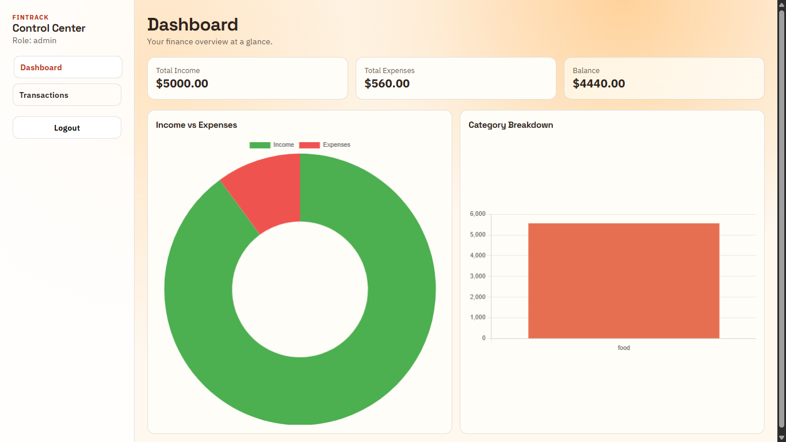
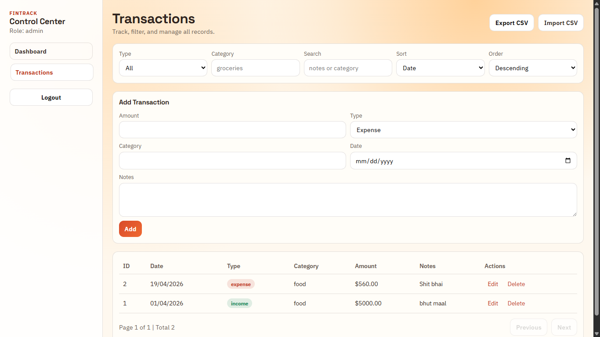
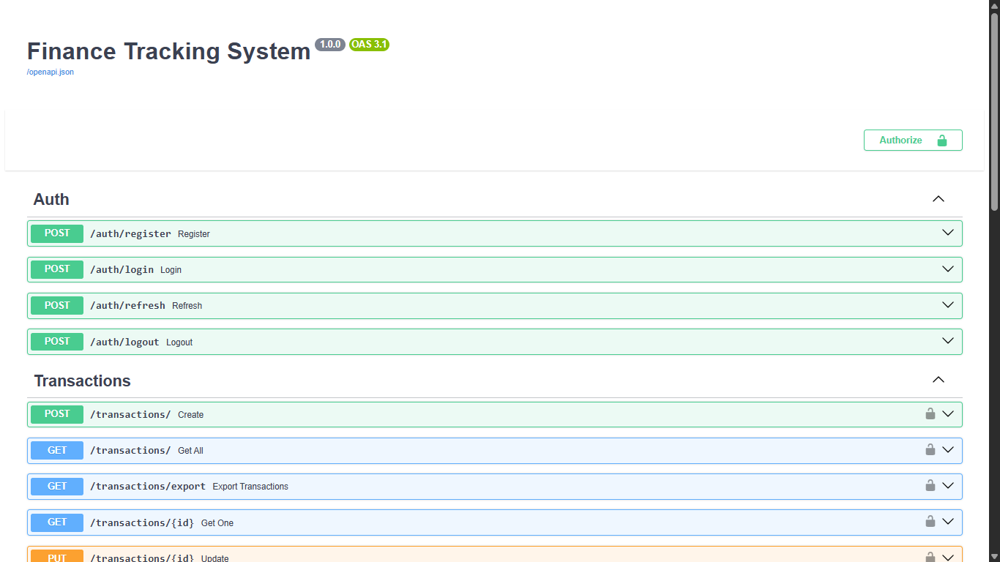

# FinTrack - Personal Finance Management (Full Stack)





Full-stack finance tracking application with JWT authentication, role-based access control, analytics, CSV import/export, and a React dashboard.

## Live Links

- Frontend: https://finance-system-tau-one.vercel.app/
- Backend API: https://finance-system-yhdh.onrender.com
- API Docs: https://finance-system-yhdh.onrender.com/docs

## Repository Structure

- app: FastAPI backend source
- alembic: database migrations
- tests: backend test suite
- finance-system-frontend: React frontend source
- requirements.txt: backend dependencies

## Tech Stack

### Backend

- FastAPI
- SQLAlchemy
- Alembic
- SQLite (default)
- JWT auth (python-jose)
- passlib with pbkdf2_sha256
- Pytest

### Frontend

- React
- Vite
- React Router
- Axios
- Chart.js with react-chartjs-2

## Implemented Features

- User signup and login
- Access token and refresh token flow
- Logout with token revocation
- Role-based access: viewer, analyst, admin
- Transaction CRUD with ownership rules
- Filtering, search, sorting, pagination
- CSV export and CSV import
- Analytics summary:
  - total income
  - total expenses
  - balance
  - category breakdown
  - monthly totals
- Dashboard charts in frontend
- Protected frontend routes
- Auto token refresh in frontend API client

## Role Matrix

- viewer:
  - Can view only own transactions
  - Cannot create, update, delete
  - Cannot access analytics
- analyst:
  - Can view only own transactions
  - Can access analytics
  - Cannot create, update, delete
- admin:
  - Can view all transactions
  - Can create, update, delete
  - Can access analytics

## Local Setup

### 1. Clone and enter project

```powershell
git clone your_repo_url
cd finance-system
```

### 2. Backend setup

```powershell
python -m venv venv
.\venv\Scripts\Activate
pip install -r requirements.txt
Copy-Item .env.example .env
alembic upgrade head
uvicorn app.main:app --reload
```

Backend runs on:

- http://127.0.0.1:8000
- Swagger docs: http://127.0.0.1:8000/docs

### 3. Frontend setup

```powershell
cd finance-system-frontend
npm install
Copy-Item .env.example .env
npm run dev
```

Frontend runs on:

- http://localhost:5173

Frontend environment variable:

- VITE_API_URL=http://localhost:8000

## Backend Environment Variables

From `.env.example`:

- DATABASE_URL
- SECRET_KEY
- TOKEN_ALGORITHM
- ACCESS_TOKEN_EXPIRE_MINUTES
- DEFAULT_PAGE_SIZE
- MAX_PAGE_SIZE

## API Summary

### Auth

- POST /auth/register
- POST /auth/login
- POST /auth/refresh
- POST /auth/logout

### Transactions

- POST /transactions/ (admin)
- GET /transactions/
- GET /transactions/export
- POST /transactions/import (admin)
- GET /transactions/{id}
- PUT /transactions/{id} (admin)
- DELETE /transactions/{id} (admin)

GET /transactions/ supports:

- type
- category
- categories
- search
- amount_min, amount_max
- from_date, to_date
- skip, limit
- sort_by: id, date, amount, category, type
- sort_order: asc, desc

### Analytics

- GET /analytics/summary (analyst, admin)

## Testing

Run tests from project root:

```powershell
.\venv\Scripts\python.exe -m pytest -q
```

Current status: 15 tests passing.

## Database Migrations

```powershell
alembic revision --autogenerate -m "describe change"
alembic upgrade head
alembic downgrade -1
```

## Deployment Notes

### Backend (Render)

- Root directory: repository root
- Start command:

```powershell
uvicorn app.main:app --host 0.0.0.0 --port $PORT
```

- Set backend environment variables from `.env.example`
- Update CORS allow_origins in `app/main.py` with your real frontend domain

### Frontend (Vercel)

- Root directory: finance-system-frontend
- Build command: npm run build
- Output directory: dist
- Environment variable:

```text
VITE_API_URL=your_backend_url
```

## Final Submission Checklist

- GitHub repository is clean and up to date
- README includes backend and frontend setup
- Backend deployed successfully
- Frontend deployed successfully
- Live website link works
- API docs link works
